# Créer son propre skin sur Celeste

Cette documentation concerne la création et comment organiser votre skin sur Celeste.  
Si vous ne savez pas quoi faire ou par où commencer, alors nous essayerons de répondre à votre/vos question(s) ici.

---

## SOMMAIRE

- Composition du dossier du skin  
- Everest.yaml  
- SkinModHelperConfig.yaml  
- Dossier « Dialog »  
- Dossier « Graphics »  
- Dossier « Atlases »  
- Dossier « Portraits »  
- Dossier « Gameplay »  
- Dossier « characters »  
- Configuration skin  
- Colorgrading  
- Position Frames Animations  
- Paramètres de Skin Mod Helper Plus  
- « Advanced Options »  
- Celeste NET  
- Recommandations Logiciels  

---

## Composition du dossier du skin

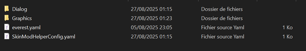

Votre skin doit être un fichier zip contenant ces dossiers et fichiers :

Afin d’obtenir ce fichier ZIP bien organisé, je vous conseille d’aller voir ce GitHub (créé par Kuksa) qui vous préparera un fichier ZIP pour vous avec tout ce dont vous aurez besoin pour votre skin (certaines animations peuvent manquer si vous faites un skin avec ou sans sac-à-dos, faites donc attention d’avoir tout ce qu’il vous faut !) :  

🔗 [Celeste Skinmod Template](https://kuksattu.github.io/celeste/skinmod-template)

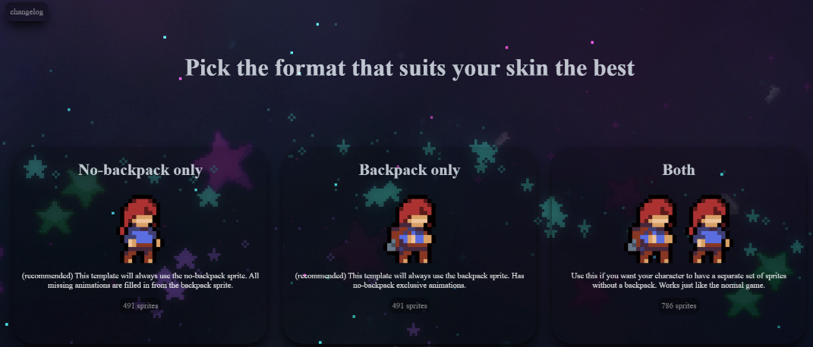

 

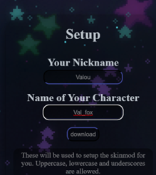

Sur ce GitHub se trouve un choix parmi 4 types de skins :

- « No-backpack only » : qui vous fera un ZIP avec le sprite de Madeline sans backpack.  
- « Backpack only » : qui vous fera un ZIP des sprites avec backpack.  
- « Both » : qui vous fera un ZIP des sprites avec et sans backpack (qui seront séparés).  
- « Reduced Spritecount » : qui vous fera un ZIP très réduit avec le moins d’efforts à faire pour créer le skin.  

Pour les personnes débutantes, je vous conseille d’opter pour le ZIP « Reduced Spritecount », ce dernier vous permettra de gagner du temps, si vous le jugez nécessaire, vous pourrez rajouter d’autres sprites pour obtenir un rendu plus fluide.

⚠️ **ATTENTION : le ZIP « Reduced Spritecount » a été enlevé par son/sa créateur/rice (il sera de retour plus tard sous de meilleures conditions, et cette documentation sera mise à jour le moment venu).**  

Votre « Nickname » et le nom de votre personnage feront partie de vos dossiers pour votre skin, vous les verrez souvent entre certains dossiers (dans le cas ci-dessous Valou/Val_fox/).  
Pour mieux vous expliquer « Valou/Val_fox / » se traduit par « YourName/YourCharacter/ » et sert à éviter les conflits avec d'autres sprites du même nom mais également cela correspond au système de nommage standard utilisé par la communauté Celeste pour l’architecture des mods.

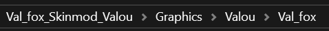

---

## Everest.yaml

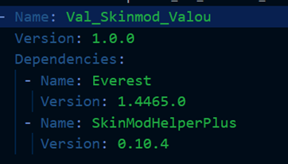

Juste un fichier contenant les dépendances de votre skin.

---

## SkinModHelperConfig.yaml

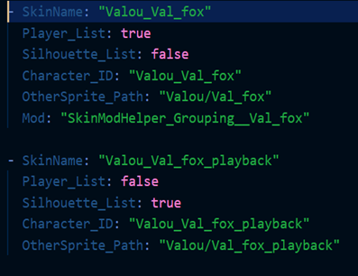

- `SkinName` = le nom de votre skin  
- `Player_List` = activer si le skin est dans la liste du skin joueur/euse 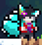  
- `Silhouette_List` = activer si le skin est dans la liste du skin silhouette, aussi appelé « playback » (à activer uniquement si vous comptez en faire un)   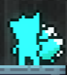
- `Character_ID` = nom utilisé dans vos fichiers `.xml`  
- `OtherSprite_Path` = chemin des dossiers menant au second fichier `Sprites.xml` pour les sprites supplémentaires.

---

## Dossier « Dialog »

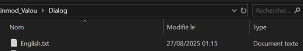

 

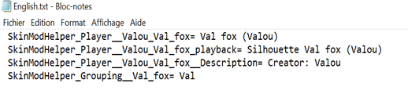

Dans ce fichier `.txt`, vous pourrez nommer les noms de vos types de skins (normal ou playback) :

- `SkinModHelper_Player__Valou_Val_fox` = nom du skin joueur/euse  
- `SkinModHelper_Player__Valou_Val_fox_playback` = nom du skin silhouette 
- `SkinModHelper_Player__Valou_Val_fox__Description` = Description du skin (nom du créateur/rice)  
- `SkinModHelper_Grouping__Valou_Val_fox` = nom du mod de votre skin  

---

## Dossier « Graphics »

Les fichiers `.xml` :

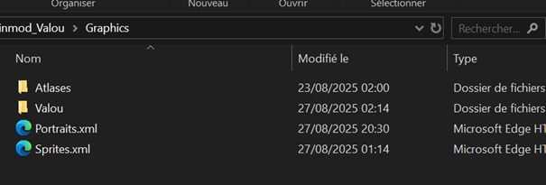

 

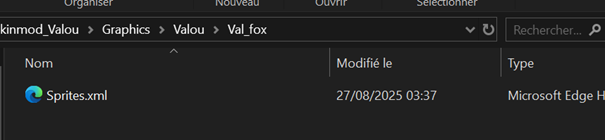

Vous avez deux types de fichiers `.xml`, « Portraits » (contenant les informations sur les visages et boîtes de texte des différents personnages) et « Sprites » (contenant les informations sur chaque sprite de votre skin), nous verrons ces informations un peu plus en détail plus bas dans le document.

Vous avez certainement remarqué qu’il y a deux fichiers « Sprites », le premier se situant dans le dossier « Graphics » contient les informations des animations du jeu de base et des mods ainsi que sur le sprite « playback ».
Le second regroupe les informations sur les sprites utilisant des objets, par exemple, quand Madeline utilise la paire de jumelles (animation « Lookout »).

**Attention : si vous mettez des animations de sprites utilisant un objet dans le premier fichier Sprites.xml, ces derniers vont rester actifs même si vous changez de skin, donc gardez bien à l’esprit qu’il faut séparer les sprites avec et sans objet.**

L’intérieur d’un fichier `.xml` ressemble à ceci :

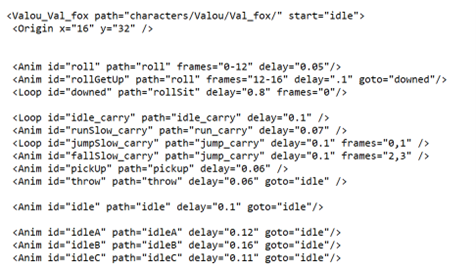

 

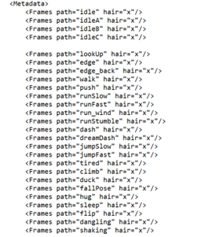

 

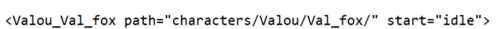

Vous avez le chemin menant à vos sprites commençant directement depuis le dossier « Gameplay » (`n’oubliez pas le « / » à la fin de votre chemin`) et start avec sur quelle animation votre skin va commencer.

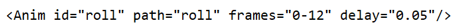

Chaque ligne comme celle-ci possède une ID qui est un nom d’une animation référencée aussi dans le code même du jeu, un chemin (path) qui montre le chemin de dossiers menant jusqu’à l’animation, les frames qui sont le nombre de sprites pour une animation (exemple pour l’animation « roll » ci-dessus, les frames vont du sprite « roll0 » au sprite « roll12 »).
Mais ces frames peuvent être changées pour vous donner d’autres possibilités pour vos animations, pas besoin de faire défiler votre animation en allant juste de 0 à 12, vous pouvez faire ce que vous voulez :

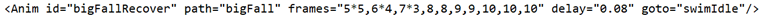 

Par exemple, dans cette animation avec des frames comme :

« 5*5, 6*4, 7*3, 8, 8, 9, 9, 10, 10, 10 »

Nous pouvons traduire cela par :

« 5, 5, 5, 5, 5, 6, 6, 6, 6, 7, 7, 7, 8, 8, 9, 9, 10, 10, 10 »

Voulant dire que sur le total des 19 frames :

-	Les 5 premières sont le sprite « 5 » 
-	Les 4 suivantes le sprite « 6 »
-	Les 3 suivantes le sprite « 7 »
-	Les 2 suivantes le sprite « 8 »
-	Les 2 autres suivantes le sprite « 9 » 
-	Les 3 dernières sont le sprite « 10 »

Le « delay » est le temps (en seconde) entre chaque sprite de l’animation (à noter que 0.1 delay = 10 FPS) :

Exemple avec l’animation « idle » ayant un « delay » de 0.1 :

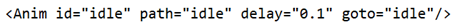

0 delay      0,1 delay           0,2 delay           0,3 delay        0,4 delay            0,5 delay         0,6 delay

 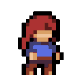 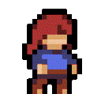 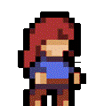 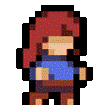 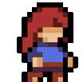  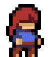

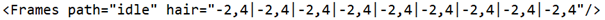

Dans la partie « metadata » se trouve également un chemin de dossiers mais également une variable « hair » dans laquelle se trouve la position x et y des coordonnées des pixels des cheveux sur chaque frame de l’animation. Ces coordonnées sont placées par rapport aux coordonnées d’origine du sprite (appelées « Origin » dans le fichier .xml), ces coordonnées sont séparées par un « | », ci-dessus vous voyez :

`« -2,4|-2,4|-2,4|-2,4|-2,4|-2,4|-2,4|-2,4 |-2,4 »`

Vous pouvez le visualiser ainsi :

`« x, y|x, y|x, y|x, y|x, y|x, y|x, y|x, y |x, y »`

Les premières coordonnées sont pour la frame 0, dans ce cas précis le sprite « idle0 » et les prochaines seront pour « idle1 », « idle2 » … jusqu’à « idle8 ». Comme ceci :

`«      x, y     |     x, y       |       x, y    |        x, y   |       x, y    |        x, y   |       x, y    |        x, y     |       x, y     » `

`« frame 0 | frame 1 | frame 2 | frame 3 | frame 4 | frame 5 | frame 6 | frame 7  | frame 8 »`

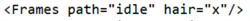

Si vous mettez un « x » à la place des coordonnées, les pixels seront retirés. 

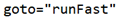

Certaines lignes possèdent « goto » qui représente l’animation qui va se jouer à la suite de l’animation en question.

---

## Dossier « Atlases »

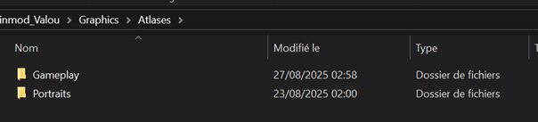

Dans le dossier « Atlases » se trouve deux dossiers :  

- le dossier **Gameplay** où vont se trouver tous les sprites de votre skin,  
- et le dossier **Portraits** où vont se trouver les images des portraits de votre skin (vous n’êtes pas obligé(e) d’avoir des portraits pour votre skin).  

Passons rapidement sur le dossier « Portraits » :

---

## Dossier « Portraits »

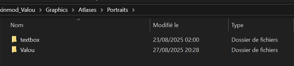

Il contient un dossier **textbox** où vous aurez la boîte de dialogue de votre personnage.  

Et le second dossier correspond à celui contenant les expressions du visage de votre personnage :  

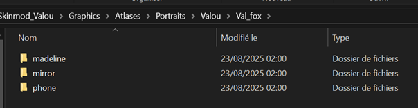

- le dossier **madeline** pour les expressions courantes de votre skin

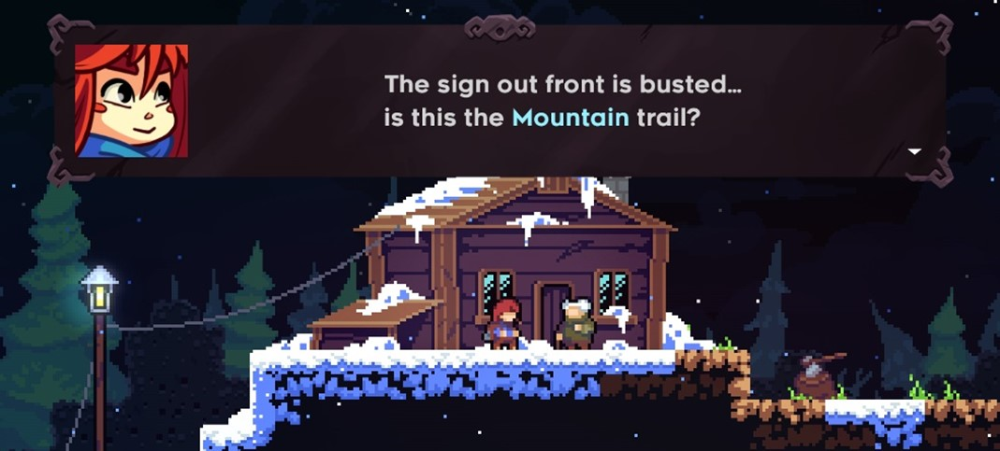

- le dossier **mirror** pour les expressions de votre skin au cours du chapitre 5

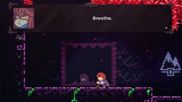

- le dossier **phone** pour les expressions de votre skin à la fin du chapitre 2

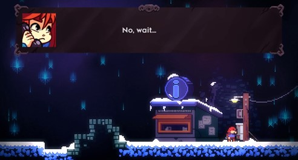

---

## Dossier « Gameplay »

Maintenant passons au dossier « Gameplay »  

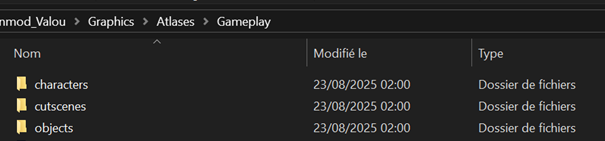

Il contient un total de 3 dossiers :  

- Un dossier **objects** contenant l’animation des jumelles

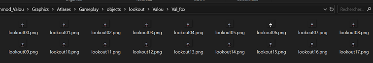

- Un dossier **cutscenes** avec l’animation du téléphone du chapitre 2A 

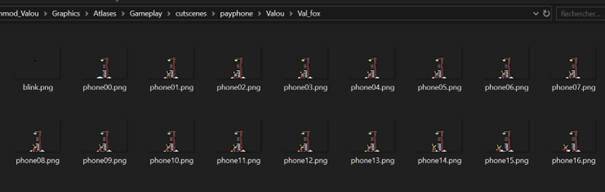

- Un dossier **characters** avec toutes les animations du skin et du playback (du jeu de base et des mods)

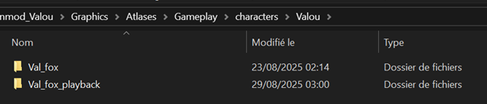

---

## Dossier « characters »

### Skin classique :  

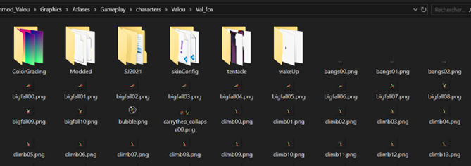

### Playback :  

`Le screen du dossier que je vais vous montrer est celui que j’ai fait moi-même, il ne sera pas déjà prêt pour vous quand vous aurez votre fichier ZIP entre vos mains.`

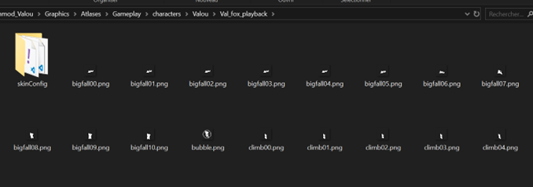

⚠️ **ATTENTION : Quand vous téléchargerez votre fichier ZIP, vous obtiendrez un dossier avec un fichier « READ.me » vous disant ceci :**

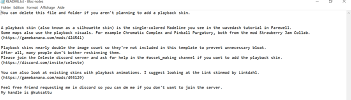

 

Regardons le dossier du skin classique :

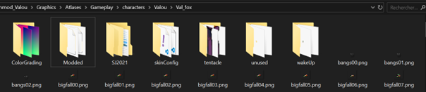

Vous devez avoir les dossiers :  

- `ColorGrading` (qui va gérer le changement de couleur de votre dash sur votre skin),  
- `Modded` (celui n’est pas obligatoire mais il contient les sprites de différents helpers/mods),  
- `SJ2021` (celui n’est pas obligatoire et a été ajouté manuellement par mes soins, il contient des animations du niveau Paint de la Strawberry Jam),  
- `skinConfig` (qui contient deux fichiers `.cs` qui gèrent les paramètres graphiques de votre skin, nous y reviendrons plus tard),  
- `unused` (qui contient des frames non utilisées),  
- Et les dossiers `tentacle` et `wakeUp` contiennent des sprites du jeu de base pour votre skin (chapitre 6 avec les tentacules de Badeline et le réveil de Madeline du chapitre 2).  

Le reste des fichiers sont les sprites du jeu de base pour votre skin, à vous de les modifier également comme bon vous semble.  

 

Avant de se plonger dans les dossiers `skinConfig` et `Colorgrading`, j’aimerais vous parler de ce fichier s’appelant **bang**.  

"Bang"

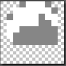

Sprite (idle)

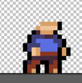

Sur Celeste, les cheveux de Madeline sont séparés de son corps, si vous voulez modifier la base des cheveux, alors modifiez le fichier « bang », ou alors vous pouvez directement mettre les cheveux sur le corps de base du skin (certains skins ont les cheveux directement sur le sprite, laissez-les).  
⚠️ **Mais attention, si vous mettez les cheveux directement sur le sprite, ils ne réagiront pas au vent et aux mouvements directionnels.** 

---

## Configuration skin

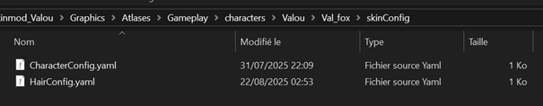

Maintenant, le dossier « SkinConfig »  

Il contient deux fichiers :  

 

### CharacterConfig

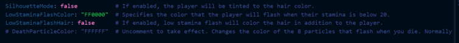

- **SilhouetteMode** : Le sprite sera teinté de la couleur des cheveux si en « true » (c’est pour cela que les sprites du skin playback sont blancs).  
- **LowStaminaFlashColor** : Spécifie la couleur qui clignotera lorsque l'endurance du joueur/euse sera faible/épuisée.  
- **LowStaminaFlashHair** : Indique une endurance faible qui colorera les cheveux en plus du sprite.  
- **DeathParticleColor** : Spécifie la couleur des particules du skin quand ce dernier meurt.  

 

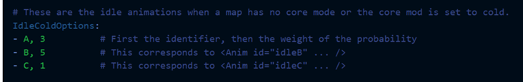

- **IdleColdOptions** : Représente la probabilité que l’animation « idle » A, B ou C se joue quand il y a le mode « froid » de Core sur la map (chapitre 8) ou quand il n’y a pas de mode :  
  - 3 chances sur 9 pour avoir l’animation « idleA »  
  - 5 chances sur 9 pour avoir l’animation « idleB »  
  - 1 chance sur 9 pour avoir l’animation « idleC »  

#### Mode « froid » du chapitre 8 :

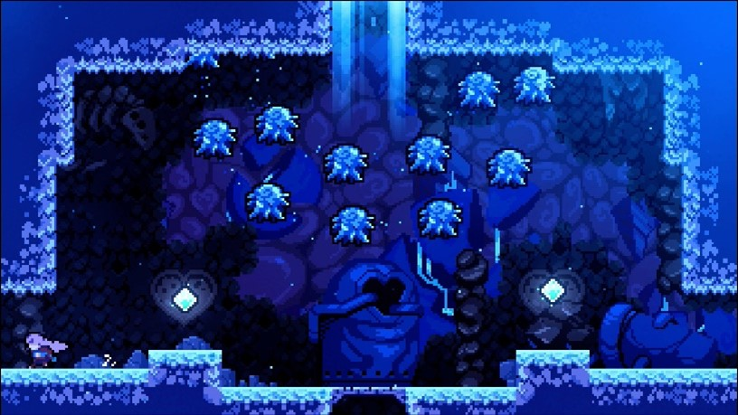

 

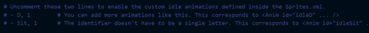

Ces deux lignes sont là si vous souhaitez activer des animations customisées que vous pouvez supprimer (informations sur le Sprites.xml dans le dossier « Graphics »).  
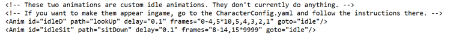

 

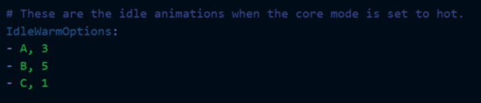

- **IdleWarmOptions** : Représente la probabilité que l’animation « idle » A, B ou C se joue quand il y a le mode « chaud » de Core sur la map (chapitre 8) :  
  - 3 chances sur 9 pour avoir l’animation « idleA »  
  - 5 chances sur 9 pour avoir l’animation « idleB »  
  - 1 chance sur 9 pour avoir l’animation « idleC »
 
#### Mode « chaud » du chapitre 8 :

 

- **IdleAnimationChance** : Représente la probabilité que les animations « idleA », « idleB », « idleC » soient jouées à la fin de l’animation « idle ».  

 

### HairConfig

 

 

- **HairFlash** : Active le flash blanc qui apparaît lorsque votre nombre de dashs change.  
- **HairFloatingDashCount** : Spécifie le nombre de dashs auxquels les cheveux du skin flottent (comme quand Madeline possède deux dashs).  
- **OutlineColor** : Spécifie la couleur du contour des cheveux, et non celle du sprite.  
- **BangsOffset** : Permet de changer la position du sprite « bang » skin (à faire si ce dernier dépasse la taille de 10x10).  
- **HairOffset** : Permet de changer la position des cheveux du skin (à faire si ce dernier dépasse la taille de 10x10).  
- **Dashes** : Représente le nombre de dashs du skin (« -1 » pour la plume, « 0 » pour aucun dash etc…).  
- **Color** : Modifie la couleur des cheveux et du dash (traînée visuelle) de votre skin en agissant comme un filtre (en code HEX) en fonction de votre nombre de dashs.  
- **Scale** : Modifie la taille des cheveux de votre skin (du début à la fin) en fonction de votre nombre de dashs.  
- **Length** : Modifie la longueur des cheveux de votre skin en fonction de votre nombre de dashs.  

---

## Colorgrading

Le colorgrading est une étape très importante dans la confection de votre skin. 

Le colorgrading est une palette de couleurs qui va remplacer les couleurs qui seront sur votre skin par les couleurs modifiées.  

👉 Exemple :  

**Colorgrading vide, sans modification**  

**Colorgrading avec modification**  

**Sprite dans votre fichier ZIP**  

**Sprite dans le jeu**  

Le colorgrading n’est qu’une palette sur laquelle vous posez les couleurs que vous voudrez voir à la place d’autres couleurs sur votre skin (et cela pour chaque dash).

Les couleurs de la palette de base (colorgrading vide, sans modification) que vous mettrez sur votre skin vont donc être remplacées en jeu par les nouvelles couleurs que vous aurez placées sur la palette (colorgrading avec modification).

*N’oubliez pas d’avoir le bon nom pour votre fichier de colorgrading ! (« dash1 » pour quand votre skin n’a que 1 seul dash etc… voir le screenshot du dossier ci-dessus un peu plus haut).*

⚠️ **Attention : Certaines animations de helpers/mods et vanilla peuvent ne pas prendre en compte le colorgrading, vous devrez donc appliquer la couleur de votre dash directement sur le sprite.**

---

## Position Frames Animations

Ceci est un point assez spécifique mais je me devais de l’écrire ici, si vous cherchez à modifier la position d’un sprite précis dans une animation, sachez que vous pouvez !

Je m’explique, si vous voulez par exemple changer la position de la frame 13 de l’animation « idleB », vous devez tout simplement avoir un fichier « .meta.yaml » avec le nom de votre frame (ici « idleB13.meta.yaml ») et vous y mettez simplement de combien de pixels vous voulez décaler votre sprite : 
 
Intérieur de votre dossier avec vos sprites :

Intérieur du fichier « .meta.yaml » :

*Ici, le sprite « idleB13 » sera décalé uniquement de 12 pixels à gauche.*

⚠️ **Attention : Votre fichier « .meta.yaml » doit être dans le même dossier que le sprite concerné.** 

---

## Paramètres de Skin Mod Helper Plus

- **Variant** 
 
- **Otherself variant**
*PS : Je n’en ai pas pour mon skin (je vous laisse le lien du mod pour voir par vous-même).*

👉 Lien du mod :  
🔗 [Otherself Mod](https://gamebanana.com/mods/53734) 

- **Silhouette variant**  

---

## « Advanced Options »

Ces paramètres ci-dessous sont pour savoir si vous souhaitez utiliser des animations spécifiques ou alors celles par défaut (celles dans les dossiers de votre skin).  

 

---

## Celeste NET

« Celeste NET » est un mod permettant de faire du multijoueur sur Celeste, vous pouvez également montrer votre skin à vos amis !

Il vous suffira que la personne qui joue avec vous possède votre fichier ZIP afin que Celeste NET puisse reconnaître le skin et l’affiche de son côté.

---

## Recommandations Logiciels

Petite section, si vous ne savez pas vraiment par où commencer afin de créer votre skin, voici quelques logiciels gratuits pour faire de la création de sprites et créer d’autres choses :  

- [Paint.Net](https://www.getpaint.net/)  
- [Krita](https://krita.org/)  
- [Piskel](https://www.piskelapp.com/)  
- [GraphicsGale](https://graphicsgale.com/us/)  
