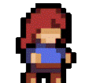

# Créer son propre skin sur Celeste

Cette documentation concerne la création et comment organiser votre skin sur Celeste.  
Si vous ne savez pas quoi faire ou par où commencer, alors nous essayerons de répondre à votre/vos question(s) ici.

---

## SOMMAIRE

- Composition du dossier du skin  
- Everest.yaml  
- SkinModHelperConfig.yaml  
- Dossier « Dialog »  
- Dossier « Graphics »  
- Dossier « Atlases »  
- Dossier « Portraits »  
- Dossier « Gameplay »  
- Dossier « characters »  
- Configuration skin  
- Colorgrading  
- Position Frames Animations  
- Paramètres de Skin Mod Helper Plus  
- « Advanced Options »  
- Celeste NET  
- Recommandations Logiciels  

---

## Composition du dossier du skin

Votre skin doit être un fichier zip contenant ces dossiers et fichiers :

Afin d’obtenir ce fichier ZIP bien organisé, je vous conseille d’aller voir ce GitHub (créé par Kuksa) qui vous préparera un fichier ZIP pour vous avec tout ce dont vous aurez besoin pour votre skin (certaines animations peuvent manquer si vous faites un skin avec ou sans sac-à-dos, faites donc attention d’avoir tout ce qu’il vous faut !) :  

🔗 [Celeste Skinmod Template](https://kuksattu.github.io/celeste/skinmod-template)

 

Sur ce GitHub se trouve un choix parmi 4 types de skins :

- « No-backpack only » : qui vous fera un ZIP avec le sprite de Madeline sans backpack.  
- « Backpack only » : qui vous fera un ZIP des sprites avec backpack.  
- « Both » : qui vous fera un ZIP des sprites avec et sans backpack (qui seront séparés).  

Votre « Nickname » et le nom de votre personnage feront partie de vos dossiers pour votre skin, vous les verrez souvent entre certains dossiers (dans le cas ci-dessous Valou/Val_fox/).  
Pour mieux vous expliquer « Valou/Val_fox / » se traduit par « YourName/YourCharacter/ » et sert à éviter les conflits avec d'autres sprites du même nom mais également cela correspond au système de nommage standard utilisé par la communauté Celeste pour l’architecture des mods.

---

## Everest.yaml

Juste un fichier contenant les dépendances de votre skin.

---

## SkinModHelperConfig.yaml

- `SkinName` = le nom de votre skin  
- `Player_List` = activer si le skin est dans la liste du skin joueur/euse   
- `Silhouette_List` = activer si le skin est dans la liste du skin silhouette, aussi appelé « playback » (à activer uniquement si vous comptez en faire un)   
- `Character_ID` = nom utilisé dans vos fichiers `.xml`  
- `OtherSprite_Path` = chemin des dossiers menant au second fichier `Sprites.xml` pour les sprites supplémentaires.

---

## Dossier « Dialog »

 

Dans ce fichier `.txt`, vous pourrez nommer les noms de vos types de skins (normal ou playback) :

- `SkinModHelper_Player__Valou_Val_fox` = nom du skin joueur/euse  
- `SkinModHelper_Player__Valou_Val_fox_playback` = nom du skin silhouette 
- `SkinModHelper_Player__Valou_Val_fox__Description` = Description du skin (nom du créateur/rice)  
- `SkinModHelper_Grouping__Valou_Val_fox` = nom du mod de votre skin  

---

## Dossier « Graphics »

Les fichiers `.xml` :

 

Vous avez deux types de fichiers `.xml`, « Portraits » (contenant les informations sur les visages et boîtes de texte des différents personnages) et « Sprites » (contenant les informations sur chaque sprite de votre skin), nous verrons ces informations un peu plus en détail plus bas dans le document.

Vous avez certainement remarqué qu’il y a deux fichiers « Sprites », le premier se situant dans le dossier « Graphics » contient les informations des animations du jeu de base et des mods ainsi que sur le sprite « playback ».
Le second regroupe les informations sur les sprites utilisant des objets, par exemple, quand Madeline utilise la paire de jumelles (animation « Lookout »).

**Attention : si vous mettez des animations de sprites utilisant un objet dans le premier fichier Sprites.xml, ces derniers vont rester actifs même si vous changez de skin, donc gardez bien à l’esprit qu’il faut séparer les sprites avec et sans objet.**

L’intérieur d’un fichier `.xml` ressemble à ceci :

 

 

Vous avez le chemin menant à vos sprites commençant directement depuis le dossier « Gameplay » (**n’oubliez pas le « / » à la fin de votre chemin**) et start avec sur quelle animation votre skin va commencer.

Chaque ligne comme celle-ci possède une ID qui est un nom d’une animation référencée aussi dans le code même du jeu, un chemin (path) qui montre le chemin de dossiers menant jusqu’à l’animation, les frames qui sont le nombre de sprites pour une animation (exemple pour l’animation « roll » ci-dessus, les frames vont du sprite « roll0 » au sprite « roll12 »).
Mais ces frames peuvent être changées pour vous donner d’autres possibilités pour vos animations, pas besoin de faire défiler votre animation en allant juste de 0 à 12, vous pouvez faire ce que vous voulez :

 

Par exemple, dans cette animation avec des frames comme :

« 5 x 5, 6 x 4, 7 x 3, 8, 8, 9, 9, 10, 10, 10 »

Nous pouvons traduire cela par :

« 5, 5, 5, 5, 5, 6, 6, 6, 6, 7, 7, 7, 8, 8, 9, 9, 10, 10, 10 »

Voulant dire que sur le total des 19 frames :

-	Les 5 premières sont le sprite « 5 » 
-	Les 4 suivantes le sprite « 6 »
-	Les 3 suivantes le sprite « 7 »
-	Les 2 suivantes le sprite « 8 »
-	Les 2 autres suivantes le sprite « 9 » 
-	Les 3 dernières sont le sprite « 10 »

Le « delay » est le temps (en seconde) entre chaque sprite de l’animation (à noter que 0.1 delay = 10 FPS) :

Exemple avec l’animation « idle » ayant un « delay » de 0.1 :

0 delay      0,1 delay           0,2 delay           0,3 delay        0,4 delay            0,5 delay         0,6 delay

       

Dans la partie « metadata » se trouve également un chemin de dossiers mais également une variable « hair » dans laquelle se trouve la position x et y des coordonnées des pixels des cheveux sur chaque frame de l’animation. Ces coordonnées sont placées par rapport aux coordonnées d’origine du sprite (appelées « Origin » dans le fichier .xml), ces coordonnées sont séparées par un « | », ci-dessus vous voyez :

`« -2,4|-2,4|-2,4|-2,4|-2,4|-2,4|-2,4|-2,4 |-2,4 »`

Vous pouvez le visualiser ainsi :

`« x, y|x, y|x, y|x, y|x, y|x, y|x, y|x, y |x, y »`

Les premières coordonnées sont pour la frame 0, dans ce cas précis le sprite « idle0 » et les prochaines seront pour « idle1 », « idle2 » … jusqu’à « idle8 ». Comme ceci :

`«      x, y     |     x, y       |       x, y    |        x, y   |       x, y    |        x, y   |       x, y    |        x, y     |       x, y     » `

`« frame 0 | frame 1 | frame 2 | frame 3 | frame 4 | frame 5 | frame 6 | frame 7  | frame 8 »`

Si vous mettez un « x » à la place des coordonnées, les pixels seront retirés. 

Certaines lignes possèdent « goto » qui représente l’animation qui va se jouer à la suite de l’animation en question.

---

## Dossier « Atlases »

Dans le dossier « Atlases » se trouve deux dossiers :  

- le dossier **Gameplay** où vont se trouver tous les sprites de votre skin,  
- et le dossier **Portraits** où vont se trouver les images des portraits de votre skin (vous n’êtes pas obligé(e) d’avoir des portraits pour votre skin).  

Passons rapidement sur le dossier « Portraits » :

---

## Dossier « Portraits »

Il contient un dossier **textbox** où vous aurez la boîte de dialogue de votre personnage.  

Et le second dossier correspond à celui contenant les expressions du visage de votre personnage :  

- le dossier **madeline** pour les expressions courantes de votre skin

- le dossier **mirror** pour les expressions de votre skin au cours du chapitre 5

- le dossier **phone** pour les expressions de votre skin à la fin du chapitre 2

---

## Dossier « Gameplay »

Maintenant passons au dossier « Gameplay »  

Il contient un total de 3 dossiers :  

- Un dossier **objects** contenant l’animation des jumelles

- Un dossier **cutscenes** avec l’animation du téléphone du chapitre 2A 

- Un dossier **characters** avec toutes les animations du skin et du playback (du jeu de base et des mods)

---

## Dossier « characters »

### Skin classique :  

### Playback :  

`Le screen du dossier que je vais vous montrer est celui que j’ai fait moi-même, il ne sera pas déjà prêt pour vous quand vous aurez votre fichier ZIP entre vos mains.`

⚠️ **ATTENTION : Quand vous téléchargerez votre fichier ZIP, vous obtiendrez un dossier avec un fichier « READ.me » vous disant ceci :**

 

Regardons le dossier du skin classique :

Vous devez avoir les dossiers :  

- `ColorGrading` (qui va gérer le changement de couleur de votre dash sur votre skin),  
- `Modded` (celui n’est pas obligatoire mais il contient les sprites de différents helpers/mods),  
- `SJ2021` (celui n’est pas obligatoire et a été ajouté manuellement par mes soins, il contient des animations du niveau Paint de la Strawberry Jam),  
- `skinConfig` (qui contient deux fichiers `.cs` qui gèrent les paramètres graphiques de votre skin, nous y reviendrons plus tard),  
- `unused` (qui contient des frames non utilisées),  
- Et les dossiers `tentacle` et `wakeUp` contiennent des sprites du jeu de base pour votre skin (chapitre 6 avec les tentacules de Badeline et le réveil de Madeline du chapitre 2).  

Le reste des fichiers sont les sprites du jeu de base pour votre skin, à vous de les modifier également comme bon vous semble.  

 

Avant de se plonger dans les dossiers `skinConfig` et `Colorgrading`, j’aimerais vous parler de ce fichier s’appelant **bang**.  

"Bang"

Sprite (idle)

Sur Celeste, les cheveux de Madeline sont séparés de son corps, si vous voulez modifier la base des cheveux, alors modifiez le fichier « bang », ou alors vous pouvez directement mettre les cheveux sur le corps de base du skin (certains skins ont les cheveux directement sur le sprite, laissez-les).  
⚠️ **Mais attention, si vous mettez les cheveux directement sur le sprite, ils ne réagiront pas au vent et aux mouvements directionnels.** 

---

## Configuration skin

Maintenant, le dossier « SkinConfig »  

Il contient deux fichiers :  

 

### CharacterConfig

- **SilhouetteMode** : Le sprite sera teinté de la couleur des cheveux si en « true » (c’est pour cela que les sprites du skin playback sont blancs).  
- **LowStaminaFlashColor** : Spécifie la couleur qui clignotera lorsque l'endurance du joueur/euse sera faible/épuisée.  
- **LowStaminaFlashHair** : Indique une endurance faible qui colorera les cheveux en plus du sprite.  
- **DeathParticleColor** : Spécifie la couleur des particules du skin quand ce dernier meurt.  

 

- **IdleColdOptions** : Représente la probabilité que l’animation « idle » A, B ou C se joue quand il y a le mode « froid » de Core sur la map (chapitre 8) ou quand il n’y a pas de mode :  
  - 3 chances sur 9 pour avoir l’animation « idleA »  
  - 5 chances sur 9 pour avoir l’animation « idleB »  
  - 1 chance sur 9 pour avoir l’animation « idleC »  

#### Mode « froid » du chapitre 8 :

 

Ces deux lignes sont là si vous souhaitez activer des animations customisées que vous pouvez supprimer (informations sur le Sprites.xml dans le dossier « Graphics »).  

 

- **IdleWarmOptions** : Représente la probabilité que l’animation « idle » A, B ou C se joue quand il y a le mode « chaud » de Core sur la map (chapitre 8) :  
  - 3 chances sur 9 pour avoir l’animation « idleA »  
  - 5 chances sur 9 pour avoir l’animation « idleB »  
  - 1 chance sur 9 pour avoir l’animation « idleC »
 
#### Mode « chaud » du chapitre 8 :

 

- **IdleAnimationChance** : Représente la probabilité que les animations « idleA », « idleB », « idleC » soient jouées à la fin de l’animation « idle ».  

 

### HairConfig

 

 

- **HairFlash** : Active le flash blanc qui apparaît lorsque votre nombre de dashs change.  
- **HairFloatingDashCount** : Spécifie le nombre de dashs auxquels les cheveux du skin flottent (comme quand Madeline possède deux dashs).  
- **OutlineColor** : Spécifie la couleur du contour des cheveux, et non celle du sprite.  
- **BangsOffset** : Permet de changer la position du sprite « bang » skin (à faire si ce dernier dépasse la taille de 10x10).  
- **HairOffset** : Permet de changer la position des cheveux du skin (à faire si ce dernier dépasse la taille de 10x10).  
- **Dashes** : Représente le nombre de dashs du skin (« -1 » pour la plume, « 0 » pour aucun dash etc…).  
- **Color** : Modifie la couleur des cheveux et du dash (traînée visuelle) de votre skin en agissant comme un filtre (en code HEX) en fonction de votre nombre de dashs.  
- **Scale** : Modifie la taille des cheveux de votre skin (du début à la fin) en fonction de votre nombre de dashs.  
- **Length** : Modifie la longueur des cheveux de votre skin en fonction de votre nombre de dashs.  

---

## Colorgrading

Le colorgrading est une étape très importante dans la confection de votre skin. 

Le colorgrading est une palette de couleurs qui va remplacer les couleurs qui seront sur votre skin par les couleurs modifiées.  

👉 Exemple :  

**Colorgrading vide, sans modification**  

**Colorgrading avec modification**  

**Sprite dans votre fichier ZIP**  

**Sprite dans le jeu**  

Le colorgrading n’est qu’une palette sur laquelle vous posez les couleurs que vous voudrez voir à la place d’autres couleurs sur votre skin (et cela pour chaque dash).

Les couleurs de la palette de base (colorgrading vide, sans modification) que vous mettrez sur votre skin vont donc être remplacées en jeu par les nouvelles couleurs que vous aurez placées sur la palette (colorgrading avec modification).

*N’oubliez pas d’avoir le bon nom pour votre fichier de colorgrading ! (« dash1 » pour quand votre skin n’a que 1 seul dash etc… voir le screenshot du dossier ci-dessus un peu plus haut).*

⚠️ **Attention : Certaines animations de helpers/mods et vanilla peuvent ne pas prendre en compte le colorgrading, vous devrez donc appliquer la couleur de votre dash directement sur le sprite.**

---

## Position Frames Animations

Ceci est un point assez spécifique mais je me devais de l’écrire ici, si vous cherchez à modifier la position d’un sprite précis dans une animation, sachez que vous pouvez !

Je m’explique, si vous voulez par exemple changer la position de la frame 13 de l’animation « idleB », vous devez tout simplement avoir un fichier « .meta.yaml » avec le nom de votre frame (ici « idleB13.meta.yaml ») et vous y mettez simplement de combien de pixels vous voulez décaler votre sprite : 
 
Intérieur de votre dossier avec vos sprites :

Intérieur du fichier « .meta.yaml » :

*Ici, le sprite « idleB13 » sera décalé uniquement de 12 pixels à gauche.*

⚠️ **Attention : Votre fichier « .meta.yaml » doit être dans le même dossier que le sprite concerné.** 

---

## Paramètres de Skin Mod Helper Plus

- **Variant** 
 
- **Otherself variant**
*PS : Je n’en ai pas pour mon skin (je vous laisse le lien du mod (fait par Misirter E) pour voir par vous-même).*

👉 Lien du mod :  
🔗 [Otherself Mod](https://gamebanana.com/mods/53734) 

- **Silhouette variant**  

---

## « Advanced Options »

Ces paramètres ci-dessous sont pour savoir si vous souhaitez utiliser des animations spécifiques ou alors celles par défaut (celles dans les dossiers de votre skin).  

 

---

## Celeste NET

« Celeste NET » est un mod permettant de faire du multijoueur sur Celeste, vous pouvez également montrer votre skin à vos amis !

Il vous suffira que la personne qui joue avec vous possède votre fichier ZIP afin que Celeste NET puisse reconnaître le skin et l’affiche de son côté.

---

## Recommandations Logiciels

Petite section, si vous ne savez pas vraiment par où commencer afin de créer votre skin, voici quelques logiciels gratuits pour faire de la création de sprites et créer d’autres choses :  

- [Paint.Net](https://www.getpaint.net/)  
- [Krita](https://krita.org/)  
- [Piskel](https://www.piskelapp.com/)  
- [GraphicsGale](https://graphicsgale.com/us/)  

 
 
----------------------------------------------------------------------------------------------------------------------
 
 

# Create your own skin on Celeste

This documentation concerns the creation and organization of your skin on Celeste. 
If you do not know what to do or where to start, we will try to answer your question(s) here.

---

## SUMMARY

- Composition of the skin folder
- Everest.yaml  
- SkinModHelperConfig.yaml  
- « Dialog » folder  
- « Graphics » folder 
- « Atlases » folder  
- « Portraits » folder  
- « Gameplay » folder  
- « characters » folder   
- Skin configuration
- Colorgrading  
- Position Frames Animations  
- Skin Mod Helper Plus Settings 
- « Advanced Options »  
- Celeste NET  
- Software Recommendations  

---

## Composition of the skin folder

Your skin should be a zip file containing these folders and files:

To obtain this well-organized ZIP file, I recommend visiting this GitHub (Made by Kuksa), which will prepare a ZIP file for you with everything you need for your skin (some animations may be missing if you are making a skin with or without a backpack, so make sure you have everything you need !): 

🔗 [Celeste Skinmod Template](https://kuksattu.github.io/celeste/skinmod-template)

 

On this GitHub, you will find a selection of four types of skins :

- `No-backpack only` : which will create a ZIP file with Madeline's sprite without the backpack.
- `Backpack only` : which will create a ZIP file of the sprites with backpack.
- `Both` : which will create a ZIP file of the sprites with and without backpacks (which will be separate).

Your nickname and character name will be included in your skin folders. 
You will often see them between certain folders (in the example below, Valou/Val_fox/). To explain further, ‘Valou/Val_fox/’ translates to ‘YourName/YourCharacter/’ and is used to avoid conflicts with other sprites of the same name, but it also corresponds to the standard naming system used by the Celeste community for mod architecture.

First, we will look at the files 'everest.yaml' and 'SkinModHelperConfig.yaml' :

---

## Everest.yaml

Just a file containing your skin's dependencies.

---

## SkinModHelperConfig.yaml

- `SkinName` = the name of your skin
- `Player_List` = activate if the skin is in the player skin list   
- `Silhouette_List` = activate if the skin is in the silhouette skin list, also called ‘playback’ (only activate if you intend to make one) 
- `Character_ID` = name used in your .xml files
- `OtherSprite_Path` = folder path leading to the second file ‘Sprites.xml’ for additional sprites.

---

## Dossier « Dialog »

 

In this .txt file, you can name your skin types (normal or playback) :

- `SkinModHelper_Player__Valou_Val_fox` = player skin name
- `SkinModHelper_Player__Valou_Val_fox_playback` = playback skin name
- `SkinModHelper_Player__Valou_Val_fox__Description` =  Description of the skin (name of the creator) 
- `SkinModHelper_Grouping__Valou_Val_fox` = name of your skin mod

---

## Dossier « Graphics »

`.xml` files :

 

There are two types of .xml files: ‘Portraits’ (containing information about the faces and text boxes of the different characters) and ‘Sprites’ (containing information about each sprite in your skin). We will look at this information in more detail later in the document.

You will have noticed that there are two ‘Sprites’ files. The first, located in the “Graphics” folder, contains information about the animations in the base game and mods, as well as the ‘playback’ sprite.
The second contains information about sprites that use objects, for example, when Madeline uses the binoculars (‘Lookout’ animation).

**Please note: if you put sprite animations using an object in the first Sprites.xml file, they will remain active even if you change skins, so keep in mind that you must separate sprites with and without objects.**

The inside of an `.xml` file looks like this :

 

 

You have the path leading to your sprites starting directly from the ‘Gameplay’ folder (**do not forget the ‘/’ at the end of your path**) and start with which animation your skin will begin with.

Each line like this has an ID, which is the name of an animation also referenced in the game code itself, a path showing the folder path leading to the animation, and frames, which are the number of sprites for an animation (for example, for the ‘roll’ animation above, the frames range from sprite “roll0” to sprite ‘roll12’).
But these frames can be changed to give you other possibilities for your animations. You don't need to scroll through your animation from 0 to 12, you can do whatever you want :

 

For example, in this animation with frames such as :

« 5 x 5, 6 x 4, 7 x 3, 8, 8, 9, 9, 10, 10, 10 »

We can translate this as :

« 5, 5, 5, 5, 5, 6, 6, 6, 6, 7, 7, 7, 8, 8, 9, 9, 10, 10, 10 »

Meaning that out of the total of 19 frames :

-    The first 5 are the sprite ‘5’ 
-    The next 4 are the sprite ‘6’
-    The next 3 are the sprite ‘7’
-    The next 2 are the sprite ‘8’
-    The next 2 are the sprite ‘9’ 
-    The last 3 are the sprite ‘10’

The ‘delay’ is the time (in seconds) between each sprite in the animation (note that 0.1 delay = 10 FPS):

Example with the ‘idle’ animation having a ‘delay’ of 0.1 :

0 delay      0,1 delay           0,2 delay           0,3 delay        0,4 delay            0,5 delay         0,6 delay

       

In the ‘metadata’ section, there is also a folder path and a ‘hair’ variable containing the x and y coordinates of the hair pixels in each frame of the animation. These coordinates are relative to the sprite's original coordinates (called ‘Origin’ in the .xml file) and are separated by a ‘|’. Lik above, you can see : 

`« -2,4|-2,4|-2,4|-2,4|-2,4|-2,4|-2,4|-2,4 |-2,4 »`

You can view it like this :

`« x, y|x, y|x, y|x, y|x, y|x, y|x, y|x, y |x, y »`

The first coordinates are for frame 0, in this case the sprite ‘idle0’, and the next ones will be for ‘idle1’, “idle2” ... up to ‘idle8’. Like this :

`«      x, y     |     x, y       |       x, y    |        x, y   |       x, y    |        x, y   |       x, y    |        x, y     |       x, y     » `

`« frame 0 | frame 1 | frame 2 | frame 3 | frame 4 | frame 5 | frame 6 | frame 7  | frame 8 »`

If you put an “x” in place of the coordinates, the pixels will be removed. 

Some lines have ‘goto’, which represents the animation that will play after the animation in question.

---

## « Atlases » folder

In the ‘Atlases’ folder, there are two folders :

- the ‘Gameplay’ folder, where all your skin's sprites will be located
- and the ‘Portraits’ folder, where your skin's portrait images will be located (you are not required to have portraits for your skin). 

Let's quickly go over the ‘Portraits’ folder:

---

## Dossier « Portraits »

It contains a **textbox** folder where you will find your character's dialogue box.

 And the second folder corresponds to the one containing your character's facial expressions : 

- The `madeline` folder for common expressions for your skin :

- The `mirror` folder for your skin expressions in Chapter 5 :

- The `phone` folder for your skin expressions at the end of Chapter 2 :

---

## « Gameplay » folder

Now let's move on to the ‘Gameplay’ section 

It contains a total of 3 files : 

- An `objects` folder containing the ‘lookout’ animation

- A `cutscenes` folder with the phone animation from chapter 2A

- A `characters` folder with all the animations for the skin and playback (from the base game and mods)

---

## « characters » folder

### Classic skin :  

### Playback :  

**The screenshot of the folder I am going to show you is one I made myself, it will not be ready for you when you receive your ZIP file.**

⚠️ **PLEASE NOTE: When you download your ZIP file, you will receive a folder containing a ‘READ.me’ file with the following information :**

 

Let's look at the classic skin file :

You must have the following folders:

- `ColorGrading` (which will manage the colour change of your dash on your skin)
- `Modded` (this one is not mandatory, but it contains sprites from various helpers/mods)
- `SJ2021` (this is not mandatory and was added manually by me; it contains animations from the Strawberry Jam Paint level) 
- `skinConfig` (which contains two .cs files that manage your skin's graphics settings; we will come back to this later) 
- `unused` (which contains unused frames)
- And the `tentacle` and `wakeUp` folders contain sprites from the base game for your skin (chapter 6 with Badeline's tentacles and Madeline's awakening from chapter 2)

The rest of the files are sprites from the base game for your skin, which you can also modify as you see fit.

Before diving into the ‘skinConfig’ and ‘Colorgrading’ folders, I would like to tell you about this file called ‘bang’.
 

 

Avant de se plonger dans les dossiers `skinConfig` et `Colorgrading`, j’aimerais vous parler de ce fichier s’appelant **bang**.  

"Bang"

Sprite (idle)

On Celeste, Madeline's hair is separate from her body. If you want to modify the hair base, then modify the ‘bang’ file, or you can directly place the hair on the skin's base body (some skins have the hair directly on the sprite, leave them as they are). 
⚠️ **But be careful, if you place the hair directly on the sprite, it will not react to wind and directional movements.** 

---

## Configuration skin

Now, the « SkinConfig » folder 

It contains two files :

 

### CharacterConfig

- **SilhouetteMode**: The sprite will be tinted with the hair color if set to ‘true’ (this is why the skin playback sprites are white).
- **LowStaminaFlashColor**: Specifies the colour that will flash when the player's stamina is low/exhausted.
- **LowStaminaFlashHair**: Indicates low stamina, which will colour the hair in addition to the sprite.
- **DeathParticleColour**: Specifies the colour of the skin's particles when it dies.

 

- **IdleColdOptions** : Represents the probability that animation ‘idle’ A, B, or C will play when Core's ‘cold’ mode is on the map (chapter 8) or when there is no mode:   
  -    3 out of 9 chances of getting animation ‘idleA ‘
  -    5 out of 9 chances of having the ‘idleB’ animation
  -    1 out of 9 chances of having the ‘idleC’ animation
 

#### Chapter 8 ‘Cold’ Mode :

 

These two lines are there if you wish to enable custom animations that you can delete (information on Sprites.xml in the ‘Graphics’ folder) :

 

- **IdleWarmOptions**: Represents the probability that animation ‘idle’ A, B, or C will play when Core's ‘warm’ mode is active on the map (chapter 8):
  - 3 out of 9 chances of having the ‘idleA’ animation
  - 5 out of 9 chances of having the ‘idleB’ animation
  - 1 out of 9 chances of having the ‘idleC’ animation

 
#### Chapter 8 ‘Warm’ Mode :

 

- **IdleAnimationChance**: Represents the probability that animations ‘idleA’, ‘idleB’, 'idleC' will be played at the end of the ‘idle’ animation.

 

### HairConfig

 

 

- **HairFlash**: Activates the white flash that appears when your dash count changes.
- **HairFloatingDashCount**: Specifies the number of dashes at which the skin's hair floats (such as when Madeline has two dashes).
- **OutlineColor**: Specifies the colour of the hair outline, not the sprite.
- **BangsOffset**: Allows you to change the position of the ‘bangs’ sprite (to be done if it exceeds the size of 10x10).
- **HairOffset**: Allows you to change the position of the skin's hair (to be done if it exceeds the size of 10x10).
- **Dashes**: Represents the number of dashes on the skin (‘-1’ for feather, ‘0’ for no dashes, etc.).
- **Color**: Changes the colour of your skin's hair and dash (visual trail) by acting as a filter (in HEX code) based on your number of dashes.
- **Scale**: Changes the size of your skin's hair (from start to finish) based on your number of dashes.
- **Length**: Changes the length of your skin's hair based on your number of dashes.	 

---

## Colorgrading

The colorgrading is a very important step in creating your skin.

The colorgrading is a colour palette that will replace the colours on your skin with the modified colours.

👉 Example :  

**Colorgrading empty, unchanged**  

**Colorgrading with modification**  

**Sprite in your ZIP file**  

**Sprite in the game**  

The colorgrading is simply a palette on which you place the colours you want to see instead of other colours on your skin (and this applies to each dash).

The colours in the basic palette (empty colorgrading, without modification) that you put on your skin will therefore be replaced in the game by the new colours you have placed on the palette (colorgrading with modification).

*Don't forget to use the correct name for your colorgrading file ! (‘dash1’ for when your skin only has one dash, etc. See the screenshot of the folder above).*

⚠️ **Please note: Some helper/mod and vanilla animations may not take colorgrading into account, so you will need to apply the colour of your dash directly to the sprite.**

---

## Position Frames Animations

This is a specific point, but I had to mention it here. If you want to change the position of a specific sprite in an animation, you can !

Let me explain: if, for example, you want to change the position of frame 13 of the ‘idleB’ animation, you simply need to have a ‘.meta.yaml’ file with the name of your frame (in this case, ‘idleB13.meta.yaml’) and enter the number of pixels by which you want to shift your sprite : 

Inside your folder with your sprites :

Inside the ‘.meta.yaml’ file

*Here, the sprite ‘idleB13’ will only be shifted 12 pixels to the left.*

⚠️ **Please note: Your ‘.meta.yaml’ file must be in the same folder as the sprite in question.** 

---

## Skin Mod Helper Plus Settings

- **Variant** 
 
- **Otherself variant**
*PS : I don't have one for my skin (I'll leave you the link to the mod (made by Misirter E) so you can see for yourself).*

👉 Link to the mod :  
🔗 [Otherself Mod](https://gamebanana.com/mods/53734) 

- **Silhouette variant**  

---

## « Advanced Options »

The settings below are for choosing whether you want to use specific animations or the default ones (those in your skin folders).

 

---

## Celeste NET

‘Celeste NET’ is a mod that allows you to play Celeste in multiplayer mode. You can also show your skin to your friends !

All you need is for the person playing with you to have your ZIP file so that Celeste NET can recognize the skin and display it on their side.

---

## Recommandations Logiciels

Little side note, if you don't really know where to start when it comes to creating your skin, here are some free software programs for creating sprites and other things :

- [Paint.Net](https://www.getpaint.net/)  
- [Krita](https://krita.org/)  
- [Piskel](https://www.piskelapp.com/)  
- [GraphicsGale](https://graphicsgale.com/us/)  
